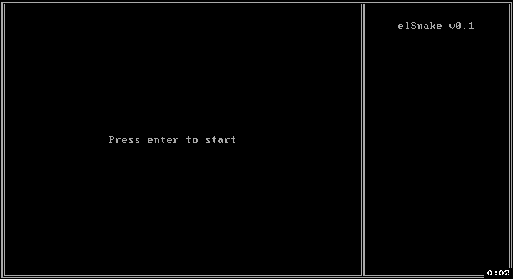

# elKernel - SnakeGame

#### 用屑語言做一個辣鷄内核跑一個貪吃蛇 (草
#### 也算是作爲一個課題 逐步學習如何製作一個OS



---

### 🤔 構建先決條件
  - 需要WSL環境
  - gas >= `v2.31.1 x86_64-linux-gnu (WSL)`
  - gld >= `v2.31.1 x86_64-linux-gnu (WSL)`
  - objcopy >= `v2.31.1 x86_64-linux-gnu (WSL)`
  - 易語言 >= `v5.5`
  - Visual Studio 2017 或更高版本

### 🐴 構建項目及環境
#### Boot Stripper 部分
  1. 進入 `source/krnln.boot.stripper`
  2. 使用易語言IDE打開 `stripper.e`
  3. 使用靜態編譯方式 編譯易代碼到本目錄 
  4. 編譯成功名爲 `stripper.exe` 請勿刪除該文件

#### Core Main 部分
  1. 進入 `source/krnln.core.main`
  2. 使用易語言IDE打開 `krnln.core.main.e` 
  3. 使用靜態編譯方式 編譯易代碼 
  4. 編譯將會失敗並殘留一個Win32 COFF文件 請勿刪除該文件

#### Bootable Floppy 部分
  1. 使用 `Visual Studio` 打開解決方案文件
  2. 將 `krnln.floppy.mk` 設爲啓動項目
  3. 直接構建

### 😩 調試環境
  > 這裏只例舉 QEMU 版本
  ```batch
    @echo off
    set PATH=%PATH%;YOUR_QEMU_INSTALLATION
    qemu-system-i386 -gdb tcp::23333 -fda ./elkernel.img
  ```
  執行批處理文件 啓動GDB 附加即可<br/>
  有關GDB調試方面不再贅述
